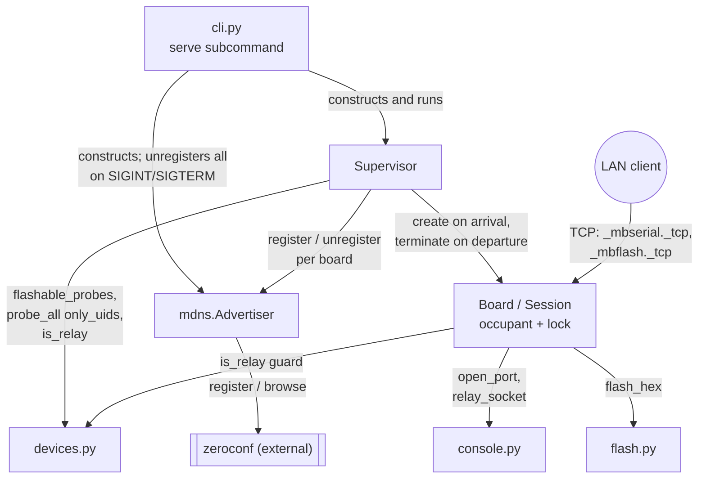

<!-- CLASI: Before changing code or making plans, review the SE process in CLAUDE.md -->

# Sprint 002: Fleet daemon

## Goals

- Build the `mbdeploy serve` daemon: watch USB, and for every board
  publish two mDNS services (`_mbserial._tcp` raw pipe, `_mbflash._tcp`
  flash) named after the board's five-letter name.
- Ship it as a systemd **system** unit, installable via
  `serve --install-service --system` — the stakeholder's binding
  deployment decision.
- Resolve two design gaps review found in the issue as written, before
  any ticket is cut.

## Problem

Sprint 2 of the 3-sprint arc for
`clasi/issues/mbdeploy-serve-a-network-facing-micro-bit-fleet-daemon.md`.
With Sprint 001 landed, port discovery and flashing work on Linux; this
sprint builds the daemon Nolanet will run — one instance per node, each
watching that node's single micro:bit on `/dev/ttyACM0`. mDNS aggregates
the four single-board daemons into one discoverable fleet naturally;
there is no four-board daemon to build.

Two gaps in the issue as written must be resolved here, not carried into
ticketing as ambiguity:

- **Board lock deadlock**: "one lock covers everything" and "a FLASH
  while a session is live wins" can't both hold if the session holds the
  lock for its lifetime — the same ambiguity means the Supervisor skips
  a board with a live session every tick, leaking its advertisement
  after unplug. Fix: lock guards only short critical sections; a
  separate `current_session` reference is what `FLASH` tears down.
- **Hotplug over-probing**: unscoped `probe_all()` on every hotplug
  opens every connected board's port and writes `HELLO`, injecting a
  stray line into boards that may be mid-run. Needs a "these UIDs only"
  parameter on `probe_all` — a `devices.py` change the issue's Files
  list omits.

## Solution

`src/mbdeploy/mdns.py` — `Advertiser`/`browse`, backed by
`python-zeroconf`, interface free of any zeroconf type.
`src/mbdeploy/server.py` — `Supervisor` (USB watcher on
`--poll-interval`), `Board`, one `selectors.DefaultSelector` accept loop,
`serve_serial`/`serve_flash`. `console.relay_socket`, same two-thread
shape as `console.interact()`. The `serve` subcommand, SIGINT/SIGTERM
unregistering everything before exit. Systemd system-unit template under
`src/mbdeploy/service/`, shipped via
`[tool.hatch.build.targets.wheel] artifacts`.

An early spike verifies `python-zeroconf` coexists with the
`avahi-daemon` already running on a Nolanet node (active on all four) —
a certainty to confirm on hardware, not a risk to assume away.

## Success Criteria

- No-hardware unit tests pass, covering: `mdns.py` register/unregister
  and TXT round-tripping against a fake `Zeroconf`; raw pipe, `ERR busy`,
  `FLASH` parsing, relay guard, `--no-flash`, `--token`,
  flash-kills-session, and `SIGTERM` in `test_server.py`; and
  `Supervisor._tick(probes)` driven directly with stubbed probe lists.
- Avahi coexistence spike succeeds on a Nolanet node, `avahi-daemon`
  unmodified.
- `--print-service --system` emits a valid unit; `--install-service
  --system` installs to `/etc/systemd/system/mbdeploy.service` with
  correct `WorkingDirectory`.

## Scope

### In Scope

- `mdns.py`: `Advertiser.register/unregister/close`, `browse()`.
- `server.py`: `Supervisor`, `Board`, accept loop, `serve_serial`,
  `serve_flash`; the lock/session redesign and scoped-probe fix above.
- `console.py`: `relay_socket(ser, conn, stop)`.
- `serve` subcommand: `--config`, `--poll-interval`, `--base-port`,
  `--bind`, `--token`, `--no-flash`, `--target-mcu`, `--service-name`,
  `--print-service`/`--install-service`, `--system`.
- Systemd **system**-unit template (Swarm supports neither `--device`
  nor `--privileged`; `Linger=no` means a user unit wouldn't survive
  reboot). A macOS launchd plist may be included if trivial.
- `zeroconf` dependency; service-template artifacts in
  `[tool.hatch.build.targets.wheel]`.
- `--token` compared constant-time; `--token-file` alternative, since
  `--token` lands verbatim in the unit's `ExecStart` (world-readable via
  `systemctl cat`).
- The avahi coexistence spike.

### Out of Scope

- Client-side `--remote` (`list`/`connect`/`deploy`) — Sprint 003.
- Installing to any real node, disk reclamation, multi-node acceptance —
  Sprint 003.
- A systemd **user** unit — rejected by the stakeholder for this
  deployment.
- Any change to the `raspi-cluster` Ansible repo.

## Test Strategy

No-hardware unit tests using loopback sockets and fakes (`FakeSerial`
from `tests/test_connect.py`) — see Success Criteria for coverage. Only
the avahi-coexistence check needs a real Nolanet node.

## Architecture

**Sizing: Substantial** — three new modules (`mdns.py`, `server.py`, plus
systemd service templates under `src/mbdeploy/service/`), a new external
dependency (`zeroconf`) and a new external integration (mDNS + TCP
listeners on the LAN), and a modification to `console.py` that
`server.py` depends on. This crosses the substantial threshold on module
count, cross-module dependency, and external integration simultaneously
— not a borderline call. A component diagram is warranted and included:
`serve` composes `Supervisor`, `Board`/`Session`, `Advertiser`,
`flash.flash_hex`, and `console.py` in a way that does not exist anywhere
in the codebase today.

### Step 1 — Understand the Problem

Sprint 2 of 3 for `mbdeploy-serve-a-network-facing-micro-bit-fleet-daemon.md`.
Sprint 001 made the device layer portable to Linux and extracted
`flash.flash_hex`; this sprint builds the daemon itself: watch USB, and
for every attached board publish two mDNS services (`_mbserial._tcp`,
`_mbflash._tcp`) named after the board's five-letter name, so it's
reachable from anywhere on the LAN with no registry sync and no
configuration.

The deployment target is concrete, not hypothetical: four Nolanet
Raspberry Pi 3B nodes, each with exactly **one** micro:bit on
`/dev/ttyACM0`. mDNS aggregates the four single-board daemons into one
discoverable fleet; there is no multi-board daemon to build, but the
design must not silently assume a single-board host — a classroom
laptop running `serve` for local testing may have several boards
attached, and the architecture has to be correct there too.

Review of the issue as written found two gaps that would either
deadlock or silently break fleet visibility if carried into ticketing as
ambiguity (see "Design Problem 1" and "Design Problem 2" below, resolved
in Step 3). Both are settled here, not left for an implementer to
discover under a debugger.

### Step 2 — Identify Responsibilities

- **R1 — mDNS presence.** Register/unregister two services per board;
  let a client browse for them. Changes independently of everything else
  — it has no opinion about what a board is or how sessions work.
- **R2 — Per-board live state and session exclusivity.** Which board
  owns which listeners, whether a serial session or a flash currently
  occupies it, and what happens when a flash needs to preempt a session.
  This is the architecturally hard part of the sprint (Design Problem 1).
- **R3 — Fleet membership (the USB watcher).** Noticing a board arrive
  or leave without disturbing every *other* already-live board on the
  same host (Design Problem 2), and reconciling that with R2's session
  state on departure.
- **R4 — Wire protocol handlers.** Parsing `_mbserial._tcp`'s raw pipe
  and `_mbflash._tcp`'s `FLASH`/`INFO` header lines, applying
  `--token`/`--no-flash`/relay-guard access control. Depends on R2 (needs
  to know whether it may claim the board) but is a distinct concern
  (parsing bytes off a socket) from R2 (owning the board's state
  machine).
- **R5 — Process lifecycle.** The `serve` subcommand: argument parsing,
  SIGINT/SIGTERM handling, service-template generation/installation.
  Composes R1–R4 but implements none of them.
- **R6 — Scoped identity refresh.** `devices.probe_all` must be
  narrowable to "these UIDs only" so R3's watcher doesn't send a stray
  `HELLO` to every other connected board on every hotplug event. Lives in
  `devices.py`, not `server.py` — a different module than R3, changing
  for the same event (hotplug) but a distinct responsibility (identity
  discovery vs. fleet bookkeeping).

R1 and R6 have no cross-dependency on the rest — each could ship
standalone and be unit-tested with no other sprint code written yet. R2,
R3, and R4 are mutually entangled (that entanglement *is* Design Problem
1) and are resolved together below. R5 depends on R1–R4 existing.

### Step 3 — Define Subsystems and Modules

- **`mdns.py`** (new). Purpose: makes board network services discoverable
  via mDNS. Boundary: owns the `Advertiser` class
  (`register`/`unregister`/`close`) and the module-level `browse()`
  function; the only thing in the codebase that imports `zeroconf`.
  Everything outside this module deals in plain dicts and opaque
  handles, never `zeroconf.ServiceInfo`/`Zeroconf` objects, so an
  `avahi-publish`-backed implementation could replace it without
  touching a caller. Serves SUC-003.

- **`server.py` — `Board`/`Session`** (new). Purpose: owns one board's
  live network state — its two listener sockets, its two mDNS handles,
  and whichever single session currently occupies it. Boundary: exposes
  claim/release operations on its own `occupant`; nothing outside `Board`
  touches its lock or its occupant reference directly. This is where
  Design Problem 1 is resolved. Serves SUC-004, SUC-005, SUC-006.

- **`server.py` — `Supervisor`** (new). Purpose: keeps the live `Board`
  set in sync with which boards are physically connected. Boundary: owns
  the poll loop, the UID diff, and arrival/departure sequencing (bind
  listeners + register mDNS on arrival; terminate sessions + unregister
  mDNS + close listeners on departure); does not itself parse any wire
  protocol. `_tick(probes)` is directly callable, so the watcher is
  testable without sleeping or hardware. This is where Design Problem 2
  is resolved. Serves SUC-003.

- **`server.py` — session handlers (`serve_serial`, `serve_flash`)**
  (new). Purpose: implements the two services' wire protocols against a
  claimed `Board`. Boundary: takes a `Board` and an accepted socket;
  knows the protocol grammar (`AUTH`, `FLASH`, `INFO`, `ERR ...`) and the
  access-control checks (`--token` via `hmac.compare_digest`,
  `--no-flash`, the relay guard); does not manage listener lifecycles or
  mDNS — that's `Supervisor`'s job. Serves SUC-004, SUC-005, SUC-006,
  SUC-008.

- **`console.py`** (existing, extended). Purpose: unchanged — serial
  sessions with a micro:bit. Boundary extended by one function,
  `relay_socket(ser, conn, stop)`, built on the same two-thread pump
  shape as the existing `interact()`, so `serve_serial` gets a
  byte-for-byte relay with no new I/O pattern introduced into the
  codebase. Serves SUC-004.

- **`devices.py`** (existing, extended). Purpose: unchanged from sprint
  001 — discover, identify, and persist the fleet's device registry.
  Boundary extended by one parameter, `probe_all(...,
  only_uids: set[str] | None = None)`; every existing caller
  (`_cmd_probe`, `_cmd_list`) is unaffected because the default preserves
  today's unscoped behavior. This is Design Problem 2's fix. Serves
  SUC-003.

- **`cli.py`** (existing, extended). Purpose: unchanged — parse
  arguments, translate to device-layer/flash/server calls. Boundary
  extended by the `serve` subcommand: builds a `Supervisor` and an
  `Advertiser`, runs the accept loop, and handles `SIGINT`/`SIGTERM` by
  unregistering everything before exit; also `--print-service`/
  `--install-service`, which render and optionally write the systemd
  unit template. Serves SUC-003 through SUC-007.

### Design Problem 1 — the board lock, resolved

The issue's two claims — "one lock covers everything that touches a
board" and "a FLASH arriving while a session is live wins, by shutting
down the session's socket" — cannot both hold if the session holds the
lock for its lifetime: `serve_flash` would block forever on a lock only
the session it intends to kill can release. The same ambiguity breaks
`Supervisor`: a non-blocking acquire that skips a locked board would skip
a board with a long *serial* session (minutes to hours) on every tick,
never noticing its physical departure, leaking that board's mDNS
advertisement indefinitely.

**Resolution: the lock guards state transitions, not operations.**

- `Board.lock` is held only for the few instructions that read or write
  `Board.occupant` — microseconds, never for the duration of a session
  or a flash.
- `Board.occupant` is `None`, a `SerialSession`, or a `FlashSession`.
  Each session object carries its own socket, a `threading.Event` stop
  flag, and a reference to the thread running it — but the *board* only
  ever holds a reference to it, never blocks on it while holding the
  lock.
- **Claiming**: `serve_serial` acquires the lock, and if `occupant` is
  anything but `None` it releases the lock and replies `ERR busy` — a
  serial session never preempts anything. Otherwise it installs itself
  as `occupant` and releases the lock, then runs `console.relay_socket`
  with the lock held by no one.
- **Preemption**: `serve_flash` acquires the lock; if `occupant` is a
  `FlashSession`, it releases and replies `ERR busy` (two flashes never
  race). If `occupant` is a `SerialSession`, it atomically swaps in its
  own `FlashSession` as the new occupant (so a second, concurrent `FLASH`
  sees a `FlashSession` and also gets `ERR busy`) and releases the lock
  holding a reference to the *old* session. Only then, **outside the
  lock**, does it call that session's `terminate()` — set the stop
  event, shut down and close its socket — and `join()` its thread with a
  bounded timeout. Only after the old session has actually exited does
  the flash proceed. No deadlock is possible: nothing the flash waits on
  is behind the lock it already released.
- **Releasing**: every session, on exit for any reason (client
  disconnect, socket error, or being torn down by `terminate()`),
  acquires the lock, clears `occupant` only if it is still itself (guards
  against a stale clear racing a newer occupant), and releases.

**How the Supervisor observes departure without contending for the
lock**: `Supervisor._tick` detects arrival/departure purely from
`devices.flashable_probes()`'s UID set — a libusb enumeration that never
opens the board's serial port and therefore never touches `Board.lock`
or `Board.occupant` at all. A board can be mid-flash or mid-session and
still disappear from that UID set the instant it's unplugged, and the
Supervisor notices on the very next tick regardless of what the board's
occupant is doing. Once departure is detected, the Supervisor *does*
briefly take the lock to best-effort `terminate()` any live occupant
(same outside-the-lock pattern as `serve_flash`'s preemption) before
closing the board's listeners and unregistering its mDNS — but this is
now a short, non-blocking operation because nothing holds the lock for
long, so it never stalls the tick for other boards. The non-blocking
acquire the issue specifies is kept, but repurposed: it now guards only
the optional, invasive *identity refresh* step (Design Problem 2) on a
per-board basis, where skipping a momentarily-contended board for one
tick and retrying next tick is genuinely harmless.

### Design Problem 2 — hotplug over-probing, resolved

`probe_all()` as written opens *every* connected board's serial port and
writes `HELLO\n`, unscoped. On a multi-board host (a laptop, or the
classroom-testing case — not Nolanet itself, but not excludable either)
plugging in one new board would inject a stray `HELLO` into every other
already-running board — including one mid-run, mid-serial-session, or
mid-relay — every single time *any* board arrives. It would also stall
the watcher's tick for the full timeout of every board's probe, not just
the new one's.

**Resolution**: `devices.probe_all` gains
`only_uids: set[str] | None = None`. When given, the probe loop is
restricted to `[p for p in flashable_probes() if p["uid"] in only_uids]`
before anything else happens — `port_serial_map`, `probe_type` (the
`HELLO` write), and the SWD board-name read all only ever touch the UIDs
in that set. Every existing caller (`_cmd_probe`, `_cmd_list`,
indirectly `_deploy_entry`) passes nothing and gets today's unscoped
behavior exactly, so this is additive, not a behavior change to any
existing code path. `Supervisor` is the only caller that passes
`only_uids`, and it passes exactly the UID(s) that arrived on this tick
— never a departing or already-known UID, which needs no re-probe.

`only_uids` and `clear=True` are not meant to be combined (`clear` wipes
the registry down to what this call sees, which would erase every other
board's entry if scoped) — no caller does this today, but the
implementing ticket guards it explicitly (raises `ValueError`) rather
than leaving it as a footgun.

### Step 4 — Diagram

Component diagram — warranted per the sizing rationale above; this
composition does not exist in the codebase today.

No ERD — no persisted data model changes (the registry JSON schema from
sprint 001 is unchanged; TXT record fields are derived at registration
time, not stored). No separate dependency graph — the component
diagram's edges are already the module-dependency edges, and they
introduce no cycle: `cli.py → server.py → {devices.py, mdns.py,
console.py, flash.py}`, and `mdns.py → zeroconf` at the bottom. Nothing
depends back up.

### Step 5 — What Changed / Why / Impact / Migration Concerns

**What Changed**

- New `src/mbdeploy/mdns.py`: `Advertiser.register/unregister/close`,
  module-level `browse()`. TXT records carry `uid`, `role`,
  `common_name`, `enum`, `port` as UTF-8 bytes on the wire, decoded back
  to `str` by `browse()`. Instance names use the Pi's real `.local`
  hostname; zeroconf's own `name (2)` collision renaming is relied on
  rather than reimplemented.
- New `src/mbdeploy/server.py`: `Board` (lock + `occupant` state machine
  per Design Problem 1), `Supervisor` (poll-driven USB watcher;
  `_tick(probes)` callable directly; per Design Problem 2, calls
  `devices.probe_all(only_uids={arrived UIDs})` on arrival only), a
  single `selectors.DefaultSelector` accept loop shared across every
  board's listener sockets (one thread per accepted connection, not one
  thread per board — hotplug doesn't churn threads), `serve_serial`,
  `serve_flash`.
- `src/mbdeploy/console.py`: new `relay_socket(ser, conn, stop)`, same
  two-thread pump shape as `interact()`, so `serve_serial` is a
  network-facing sibling of the existing local `connect` interactive
  mode rather than a new I/O pattern.
- `src/mbdeploy/devices.py`: `probe_all` gains
  `only_uids: set[str] | None = None` (Design Problem 2). No signature
  change to any other function; every existing test and caller is
  unaffected by the default.
- `src/mbdeploy/cli.py`: new `serve` subcommand (`--config`,
  `--poll-interval`, `--base-port`, `--bind`, `--token`/`--token-file`,
  `--no-flash`, `--target-mcu`, `--service-name`,
  `--print-service`/`--install-service`, `--system`/`--user`).
  `SIGINT`/`SIGTERM` unregister every mDNS advertisement and close every
  listener before exit — this is how `systemctl stop` reaches the
  process cleanly.
- New `src/mbdeploy/service/` — a systemd **system**-unit template
  (default install path, per the stakeholder's binding decision — Swarm
  supports neither `--device` nor `--privileged`, and `Linger=no` on
  Nolanet means a user unit would not survive reboot), `--user` available
  as an explicit opt-in for non-Nolanet use. Shipped via
  `[tool.hatch.build.targets.wheel] artifacts`, the same mechanism
  `agent_manual.md` already uses.
- `pyproject.toml`: new `zeroconf` dependency; the `service/` template
  artifacts entry.
- **Token handling**: `--token` (or `--token-file`, mutually exclusive)
  resolves to a single secret string compared with `hmac.compare_digest`,
  never `==`, on both services' `AUTH` handshake. `--token-file` exists
  because `--token` lands verbatim in the installed unit's `ExecStart`,
  which `systemctl cat` makes world-readable — a real exposure on a
  shared box, not a theoretical one.

**Why**

Nolanet needs one always-on process per node that makes its board
reachable without anyone SSHing in. The two design problems above are
why this isn't a small change on top of the issue as written: the
lock/session model is the actual concurrency contract the rest of the
module depends on, and the hotplug-scoping fix is what keeps a
single-board Nolanet daemon's design honest about not assuming
single-board hosts are the only case that exists.

**Impact on Existing Components**

- `devices.py` — additive only; `port_serial_map`, `probe_type`,
  `is_relay`, and every existing `probe_all` call site are untouched.
- `console.py` — additive only; `open_port`, `send_command`, `interact`
  are untouched. `relay_socket` is new code with no existing caller to
  regress.
- `cli.py` — additive; every existing subcommand (`build`, `deploy`,
  `list`, `probe`, `connect`) is untouched. `serve` is a new leaf in the
  subparser tree.
- `flash.py` (sprint 001) — no change. `serve_flash` calls
  `flash_hex(uid, hex_path, target_mcu, log=<LOG-line emitter>)` exactly
  as sprint 001 designed it to be called; this is the seam doing its job.
- No consumer outside this sprint's own new code depends on anything
  changed here, so there is no ripple beyond what's listed.

**Migration Concerns**

- No registry schema change — sprint 001's JSON format is unchanged;
  `serve` reads it, it doesn't grow new persisted fields.
- **Operational, stated plainly rather than assumed**: all four Nolanet
  boards are currently silent (no announcing firmware), so `role` is
  empty and `is_relay()` is `False` fleet-wide today. The flash-side
  relay guard this sprint reuses (`devices.is_relay`) therefore has
  nothing to read on Nolanet at launch — it is not a real protection
  there until firmware changes independently of this sprint.
  `--no-flash` and `--token`/`--token-file` are the actual controls on
  that deployment; this is stated in the daemon's design, not left to be
  discovered when the guard doesn't fire.
- New runtime dependency `zeroconf`; confirmed to resolve to a prebuilt
  aarch64 wheel on Nolanet's Python 3.13.5/Bookworm — no compilation,
  ~83 MB venv. This is a build-time fact already verified, not a risk
  carried into implementation.
- `avahi-daemon` is active on all four Nolanet nodes and is not being
  modified or disabled by this sprint. Coexistence with `python-zeroconf`
  on port 5353 is a documented, common pattern (Home Assistant, ESPHome)
  but is being **verified on this specific hardware/OS combination
  before any other ticket's design depends on the assumption holding** —
  see Ticket 001.
- Deployment is systemd **system** units, one per node, installed
  manually per node in this sprint (no rollout automation — that's
  sprint 003's multi-node work). `--install-service` must default to the
  system-unit path on Linux; `--user` is an explicit opt-in, not the
  default, matching the stakeholder's decision.

### Step 6 — Design Rationale

**Decision: the lock guards `Board.occupant` transitions only, never a
session's or flash's duration.**
*Context*: the issue's own wording ("one lock covers everything" + "FLASH
wins by shutting down the session") is self-contradictory if taken as one
lock held for an operation's lifetime.
*Alternatives considered*: (a) a re-entrant/upgradable lock that
`serve_flash` could take over from a live session — rejected, this still
needs the session to voluntarily release under some signal, which is
exactly the outside-the-lock `terminate()`-then-join sequence anyway,
just with more lock-API surface for no benefit; (b) two locks (one for
"may I start a session/flash", one for "the operation itself") —
rejected as unnecessary complexity once the first lock is scoped
correctly, since the second lock would never actually be contended
(nothing else touches a session's internals once it's running).
*Why this choice*: it's the minimal change that makes both of the
issue's stated behaviors true simultaneously, and it gives the
Supervisor a lock-free way to detect departure (see Design Problem 1),
which the issue's design did not have.
*Consequences*: session/flash code must remember to acquire the lock
only around the specific `occupant` read/write, not around its main work
loop — a discipline documented here and enforced by the ticket's own
test coverage (flash-kills-live-session must prove the flash isn't
blocked by the session it's killing).

**Decision: `only_uids` scopes `probe_all`, rather than giving
`Supervisor` its own parallel identity-probing path.**
*Context*: the watcher needs a "these UIDs only" probe; the alternative
is writing a second `HELLO`-and-SWD-read routine inside `server.py`.
*Alternatives considered*: a `server.py`-local probing function —
rejected for the same reason sprint 001 rejected a second flash
implementation: one tested path, reused, beats a second divergent one. A
`Supervisor`-side result cache that skips re-probing recently-seen UIDs —
rejected as solving a different problem (staleness) than the one at hand
(over-probing *other* boards), and `only_uids` already makes that
scenario impossible by construction.
*Why this choice*: `devices.py` already owns every USB/serial interaction
in the codebase (an existing, deliberate boundary from sprint 001's Step
3); a parameter on its existing function is a narrower change than a new
entry point into the same hardware.
*Consequences*: `devices.py`'s public surface grows by one optional
parameter with a fully backward-compatible default; no existing caller
or test needs to change.

**Decision: `--token-file` as an alternative to `--token`.**
*Context*: `--token` on the command line is baked into the installed
systemd unit's `ExecStart`, and `systemctl cat mbdeploy` — a command any
local user can run — prints it in plain text.
*Alternatives considered*: an environment-variable-based secret
(`Environment=` in the unit, or `EnvironmentFile=`) — rejected as no more
private than `ExecStart` unless paired with `EnvironmentFile=` and a
permission-restricted file anyway, at which point it's the same idea as
`--token-file` with an extra layer; a systemd credential (`LoadCredential=`)
— more correct in principle, but adds a dependency on a systemd feature
this sprint doesn't otherwise need and would need its own testing story
with no unit-test-only way to verify it. `--token-file` is the smallest
change that gets the secret out of `ps`/`systemctl cat` output.
*Why this choice*: matches the sprint's existing "no-hardware unit
tests, one hardware spike" testing posture — a plain file path is
trivial to test without systemd at all.
*Consequences*: the operator is responsible for the file's own
permissions (documented, not enforced by `mbdeploy` beyond what the OS
gives a `0600` file); `--token` remains available for quick manual
testing where that tradeoff is acceptable.

### Step 7 — Open Questions

- **`--service-name` semantics on a multi-board host.** The issue lists
  `--service-name NAME` in the `serve` argv but doesn't specify what it
  does once a host has more than one board — a single fixed name can't
  apply to more than one board without a collision. This plan treats it
  as a single-board override (bypassing the `board_name`→`device_name`→
  `mb-<uid8>` fallback chain entirely) and requires the implementer to
  document that it only makes sense on a single-board host — exactly
  Nolanet's case. Flag to stakeholder if a different multi-board
  behavior was intended.
- **`--base-port` allocation policy under repeated hotplug.** The issue
  asks for deterministic ports but doesn't say whether a departed
  board's two ports are reclaimed for a later arrival or retired for the
  process's lifetime. This plan reclaims them (a free-list keyed on the
  same sequential allocation from `--base-port`), since Nolanet's
  one-board-per-node case never exercises this at all and a multi-board
  host doing a lot of hotplugging shouldn't leak port numbers. Stated
  here so it isn't decided silently inside a ticket.
- **`only_uids` + `clear=True`.** Flagged in Design Problem 2 — no
  caller combines them today, but the implementing ticket raises
  `ValueError` on the combination (fail loud, not silently wipe the
  registry) rather than leaving it undefined.
- **Doc lag.** Per explicit sprint scope, `agent_manual.md` §9 and the
  README/manual subcommand-table `serve` row are deferred to sprint 003,
  alongside `--remote`. That leaves `serve` shipped but essentially
  undocumented for one sprint. Flagging this tradeoff rather than
  deciding it silently — if the stakeholder wants even a one-line
  subcommand-table entry landed now, that's a small addition to Ticket
  007, not a new ticket.

### Architecture Self-Review

Full five-category review, run because this sprint is substantial.

- **Consistency** — Every module named in Step 3 appears in the diagram
  and in "What Changed"; both design-problem resolutions in Step 3 are
  exactly the two decisions Step 6 gives rationale for; no section
  claims a capability another section doesn't also describe.
- **Codebase Alignment** — Verified against the actual current tree, not
  assumed: `flash.flash_hex`'s signature already takes the `log`
  callback this design calls into (`src/mbdeploy/flash.py:36-41`);
  `console.interact()`'s two-thread pump shape (`console.py:101-134`) is
  what `relay_socket` is modeled on; `devices.probe_all`'s existing loop
  structure (`devices.py:323-369`) is what `only_uids` filters *before*,
  confirmed by reading the actual loop rather than the issue's
  paraphrase of it.
- **Design Quality** — Cohesion: every module in Step 3 states its
  purpose in one sentence without "and" joining two unrelated concerns.
  Coupling: fan-out from `Supervisor` is 3 (`devices`, `mdns`, `Board`);
  from `Board`/sessions is 3 (`console`, `flash`, `devices`) — both
  under the 4-5 guideline, and neither is incidental (each is exactly
  the one existing module that already owns that concern). No circular
  dependency — confirmed by the diagram's edge list in Step 4.
  Boundaries: `Advertiser`'s interface never leaks a `zeroconf` type;
  `Board`'s lock/occupant are private to `Board`, never reached into
  from `Supervisor` or the session handlers directly.
- **Anti-Pattern Detection** — No god component: `Supervisor` explicitly
  does not parse wire protocol, and the session handlers explicitly do
  not manage listener/mDNS lifecycle — the split in Step 3 exists
  specifically to avoid `server.py` collapsing into one component that
  does everything. No shotgun surgery: the two design-problem fixes are
  each contained to one module (`server.py`'s `Board`, and `devices.py`'s
  `probe_all` parameter) rather than rippling across files. No feature
  envy: `Board` owns its own lock and occupant; nothing outside it
  reaches in. Shared mutable state: `Board.occupant` is exactly one
  piece of shared mutable state, and it has exactly one owner
  (`Board.lock`) and one access pattern (claim/release) documented in
  Design Problem 1 — the deliberate exception the "no shared mutable
  state without a clear owner" principle allows for. No circular
  dependency (see Coupling above). No speculative generality:
  `Advertiser`'s zeroconf-free interface is justified by an
  already-named alternative backend (`avahi-publish`, per the issue)
  rather than a hypothetical one; `only_uids` has a concrete, immediate
  caller (`Supervisor`) rather than being added "for future
  flexibility."
- **Risks** — No data migration (registry schema unchanged). Breaking
  changes: none to any existing subcommand or function signature's
  default behavior. Security: the relay guard's real-world toothlessness
  on Nolanet today (Migration Concerns) is stated explicitly rather than
  silently relied on; `--token`/`--token-file` compared via
  `hmac.compare_digest` avoids a timing side-channel; `--token-file`
  addresses the `ExecStart`-visibility gap `--token` alone would leave.
  Performance: the accept loop's single selector avoids per-board thread
  churn on hotplug; `Supervisor`'s departure detection is lock-free by
  design, so a stuck board can never stall the tick for others.
  Deployment sequencing: Ticket 001 (avahi coexistence spike) is
  sequenced before any other ticket's *design* depends on the assumption
  holding, even though the code itself (built against a fake `Zeroconf`
  in tests) doesn't strictly need the spike to compile — this is a
  risk-ordering choice, not an artifact dependency, and is called out as
  such in the ticket table.

**Verdict: APPROVE.** No revisions required; proceed to ticketing.

## Use Cases

New sprint-level use cases; nothing in the existing
`docs/design/usecases.md` set changes. Sized to the substantial tier —
each below states what's new, the actor, and the acceptance signal a
ticket's tests must prove.

### SUC-003 — Board presence tracks USB plug/unplug

**Actor**: Operator, on the LAN.
**What's new**: plugging a board into a `serve`-running host registers
`_mbserial._tcp` and `_mbflash._tcp` under that board's five-letter name
within one poll interval; unplugging it unregisters both, and a live
session on that board is torn down rather than left dangling. Driven by
`Supervisor._tick(probes)`, directly testable with stubbed probe lists —
no sleeping, no hardware.
**Acceptance signal**: `test_server.py::Supervisor` drives `_tick` with a
sequence of stubbed probe lists and asserts register/unregister calls on
a fake `Advertiser`; arrival and removal are idempotent (repeating the
same tick twice doesn't double-register or error on a second
unregister); a board whose occupant is a live (faked) session is not
skipped by the tick's departure detection.

### SUC-004 — A raw serial session over the network

**Actor**: Operator or automated client, on the LAN.
**What's new**: connecting to a board's `_mbserial._tcp` port behaves
exactly like `mbdeploy connect <name>` run locally — bytes in go to the
board, bytes out come back, no handshake — except the byte pipe is
`console.relay_socket` over a TCP socket instead of `console.interact`
over stdio.
**Acceptance signal**: `test_server.py` opens a real loopback TCP
connection against a `serve_serial` handler backed by `FakeSerial`,
writes bytes, and asserts they arrive at the fake serial port; writes
from the fake serial side arrive at the socket. Tested in both
directions.

### SUC-005 — Serial session exclusivity

**Actor**: A second operator/client, on the LAN, while a first session is
open.
**What's new**: a second connection to an already-occupied
`_mbserial._tcp` gets `ERR busy\n` and is closed immediately, never
touching the serial port.
**Acceptance signal**: `test_server.py` opens one session, then a
second, and asserts the second receives exactly `ERR busy\n` and that
the first session's traffic is unaffected by the attempt.

### SUC-006 — A flash pre-empts a live session

**Actor**: Operator deploying firmware to a board someone else currently
has an open serial session with.
**What's new**: sending `FLASH` to a board with a live serial session
tears that session down (its socket closes on the other operator's end)
and the flash proceeds and completes, rather than either operation
blocking the other or erroring.
**Acceptance signal**: `test_server.py` opens a serial session, then
sends a `FLASH` request on the board's flash port with a stubbed
`flash_hex`, and asserts: the serial session's socket observably closes,
the flash proceeds and returns `OK flashed`, and this all completes
without the deadlock Design Problem 1 identifies — i.e., the test has a
bounded timeout and the flash call is not what's holding it up.

### SUC-007 — The daemon survives a reboot as a systemd system service

**Actor**: Operator installing `serve` on a Nolanet node.
**What's new**: `mbdeploy serve --install-service --system` writes a
valid unit to `/etc/systemd/system/mbdeploy.service` with the correct
`WorkingDirectory` and `ExecStart` (including `--config`, and
`--token-file` rather than a literal `--token` when a token is
configured); `--print-service --system` emits the same content to stdout
without installing. This sprint verifies the unit's content and
installation path; actually enabling it and rebooting a Nolanet node is
sprint 003's multi-node acceptance work, out of scope here.
**Acceptance signal**: unit test asserts `--print-service --system`
output is valid systemd unit syntax with the right
`WorkingDirectory`/`ExecStart`; `--install-service --system` writes to
the correct path with correct file content (the filesystem write target
is redirected in tests, per the project's no-hardware-required test
strategy).

### SUC-008 — Access control: `--no-flash` and token auth on both services

**Actor**: Operator locking down a `serve` instance exposed on a shared
LAN.
**What's new**: `--no-flash` makes every `FLASH` request get
`ERR flash disabled` without ever touching `flash_hex`;
`--token`/`--token-file` requires `AUTH <token>\n` before either service
does anything else, comparing via `hmac.compare_digest`, and rejects a
missing/wrong token with `ERR auth required`/closing the connection.
**Acceptance signal**: `test_server.py` covers `--no-flash` (FLASH gets
the error, the `flash_hex` mock is never called), and `--token` on both
`_mbserial._tcp` and `_mbflash._tcp` (correct token proceeds, wrong or
missing token is rejected).

### SUC-009 — Avahi coexistence on real Nolanet hardware

**Actor**: Whoever runs the sprint's hardware spike (operator or agent
with SSH access).
**What's new**: nothing user-visible yet — this is the sprint's
risk-retirement use case. `python-zeroconf` registering and browsing a
test service on a Nolanet node does not disrupt `avahi-daemon`, which the
node depends on independently of `mbdeploy`.
**Acceptance signal**: on a real node, a zeroconf-registered test service
is independently browsable, and `avahi-daemon` remains active and
functioning (its own advertisements still resolve) throughout and after
the test.

## Dependencies

Depends on Sprint 001 — `serve_flash` calls `flash.py::flash_hex`
directly, and needs `port_serial_map` working on Linux. Sprint 003
depends on this sprint.

## GitHub Issues

(GitHub issues linked to this sprint's tickets. Format: `owner/repo#N`.)

## Definition of Ready

Before tickets can be created, all of the following must be true:

- [x] Sprint planning document is complete (sprint.md, including its
      Architecture and Use Cases sections)
- [x] Architecture review passed (or skipped, for changes with no
      architectural impact)
- [ ] Stakeholder has approved the sprint plan

## Tickets

| # | Title | Depends On |
|---|-------|------------|
| 001 | Avahi coexistence spike: verify python-zeroconf alongside avahi-daemon on Nolanet | — |
| 002 | Scope `devices.probe_all` to specific UIDs to stop hotplug over-probing | — |
| 003 | `mdns.py`: `Advertiser` and `browse` backed by python-zeroconf | — |
| 004 | `console.relay_socket`: bidirectional serial↔socket pump for network sessions | — |
| 005 | `server.py`: `Board`/`Session` model, accept loop, `serve_serial`, `serve_flash` | 004 |
| 006 | `server.py`: `Supervisor` USB watcher (`_tick`, arrival/departure, mDNS lifecycle) | 002, 003, 005 |
| 007 | `serve` subcommand: CLI wiring, SIGINT/SIGTERM shutdown, `--token`/`--token-file` | 005, 006 |
| 008 | Systemd system-unit service templates and `--print-service`/`--install-service` | 007 |

Tickets execute serially in the order listed. 001–004 have no
inter-ticket code dependency and could in principle run in any relative
order — they're sequenced this way because 001 retires the sprint's one
hardware risk before any other ticket's *design* leans on it (not a hard
artifact dependency), and 002 is placed early per the source issue's own
instruction that the hotplug-scoping fix must land before the Supervisor
ticket that consumes it. 005 depends on 004 (`relay_socket`). 006
depends on 002 (`only_uids`), 003 (`Advertiser`), and 005 (`Board`). 007
depends on both halves of `server.py` (005, 006) to wire together. 008
extends 007's subparser and unit-generation logic.
