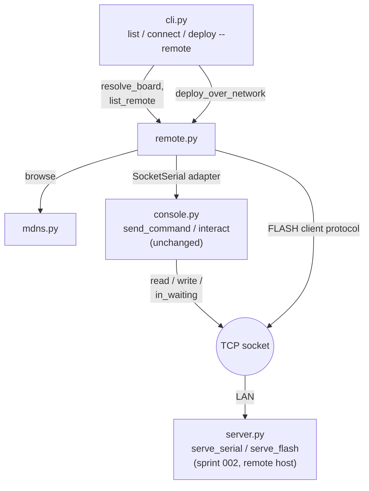

<!-- CLASI: Before changing code or making plans, review the SE process in CLAUDE.md -->

# Sprint 003: Remote client and Nolanet acceptance

## Goals

- Add `--remote` to `list`, `connect`, and `deploy`, talking to the
  daemon(s) built in Sprint 002 over the network instead of local USB.
- Stand the daemon up for real: reclaim disk on the two tightest Nolanet
  nodes, install the systemd system unit on all four nodes over SSH, and
  run the issue's full acceptance test across the real 4-node fleet.

## Problem

Sprint 3 of the 3-sprint arc for
`clasi/issues/mbdeploy-serve-a-network-facing-micro-bit-fleet-daemon.md`.
Sprints 001 and 002 make the daemon buildable and testable in isolation;
this sprint makes it usable — a laptop reaching a board over the LAN —
and proves it against real hardware: Nolanet, a 4-node Raspberry Pi
Docker Swarm (`magni`, `hodr`, `loki`, `meili`; one micro:bit per node).
The LAN crossing is the point of the feature; running the client on the
Pi itself proves nothing.

## Solution

Client-side: `mdns.browse()` for `list --remote`'s HOST column; a
socket-backed target for `connect --remote`/`deploy --remote`; argparse
rejects `--remote` combined with a `/dev/...` target. Review found the
issue's proposed socket adapter under-specified: `console.send_command()`
also calls `reset_input_buffer()`, and `console.interact()` calls
`ser.read(max(1, ser.in_waiting))`. The adapter needs six members —
`readline`, `write`, `flush`, `close`, `read`, `in_waiting` — not the
four the issue lists; missing `in_waiting` breaks only the interactive
path, which one-shot tests won't catch.

Operationally: `docker image prune -a` + `apt clean` on `magni`
(472 MB free, 93% used) and `hodr` (337 MB, 95% used) before installing
anything. Then `serve --install-service --system` over SSH as `jtl` on
all four nodes, followed by the issue's full manual acceptance script.

## Success Criteria

- `test_remote.py` passes: `--remote` argument shapes, and the socket
  adapter (all six members) against a loopback server, including the
  interactive `in_waiting` path.
- Disk reclaimed and confirmed on `magni` and `hodr` before install.
- All four Nolanet nodes run `mbdeploy serve` as an enabled, running
  systemd system service.
- `mbdeploy list --remote` from a laptop on the LAN shows 4 boards
  across 4 distinct hosts.
- Full manual acceptance passes on real hardware: LAN crossing (`nc`,
  `avahi-browse`), `connect --remote`, `deploy --remote`,
  unplug-mid-session, flash-preempts-session, two-client `ERR busy`
  race, reboot survival with no login, `journalctl` shows the log.

## Scope

### In Scope

- `--remote` on `list`, `connect`, `deploy` in `cli.py`.
- The six-member socket adapter (`readline`, `write`, `flush`, `close`,
  `read`, `in_waiting`).
- argparse: reject `--remote` together with a `/dev/...` target.
- `agent_manual.md` new §9 ("Serving a fleet over the network," incl.
  Nolanet setup) and README `serve`/`--remote` rows.
- Disk reclamation on `magni` and `hodr`.
- Installing the systemd system unit to all four Nolanet nodes over SSH.
- The full multi-node manual acceptance run from the issue's
  Verification section.

### Out of Scope

- Any change to `mdns.py`/`server.py` internals beyond what the client
  adapter needs — Sprint 002's.
- Any change to the `raspi-cluster` Ansible repo — the systemd install
  is a one-time SSH/`systemctl` action from within `mbdeploy`'s own
  tooling/docs, per the stakeholder's decision to keep this out of
  Ansible.
- Any new udev rule — Sprint 001 already confirmed Nolanet needs none.

## Test Strategy

`test_remote.py` covers the client adapter and argument validation
against a loopback server — no real hardware needed for this part. The
acceptance run itself is manual, on real hardware, and is the actual
gate for calling this arc done.

## Architecture

**Sizing: Substantial.** The roadmap sprint.md guessed compact, expecting
the socket adapter to be a small addition to `cli.py`/`console.py`
directly. Scoping it precisely in Detail Mode overturns that: the client
needs its own module (`remote.py` — mDNS resolution, the socket adapter,
and the `_mbflash._tcp` client protocol are three distinct pieces of
logic that don't belong inside `cli.py`'s argument-dispatch code, the
same cohesion reasoning sprint 001 used to extract `flash.py`), and that
module introduces a **new cross-module dependency** that didn't exist
before: `cli.py`/`remote.py` calling `mdns.browse()` directly from the
client side, a path `mdns.py` was built in sprint 002 to serve but that
had no caller until now. A new module plus a new cross-module dependency
clears the substantial threshold on its own, independent of the
three-subcommand surface area and the four-node operational rollout this
sprint also carries. Full methodology, self-review, and a diagram below.

### Step 1 — Understand the Problem

Sprint 3 of 3 for `mbdeploy-serve-a-network-facing-micro-bit-fleet-daemon.md`.
Sprint 002 built and unit-tested the daemon in isolation; nothing outside
`test_server.py`'s loopback sockets has ever talked to it. This sprint
builds the other end of the wire — `list`/`connect`/`deploy --remote` —
and then proves the whole arc on the real target: four Raspberry Pi
nodes (`magni`, `hodr`, `loki`, `meili`), one silent micro:bit each, no
announcing firmware, reachable only over the LAN. The LAN crossing is
the point; running the client on the Pi itself would prove nothing.

Two things narrow the design space concretely, verified rather than
assumed:

- All four Nolanet boards are **silent** — `role`/`common_name`/
  `device_name` are empty, so the mDNS instance name for every one of
  them comes from `board_name` read over SWD (`loki`'s is `togov`), and
  the flash-side relay guard (`is_relay(None)` → `False`) has nothing to
  read. `--no-flash`/`--token` are the real controls on this deployment,
  not the relay guard — sprint 002 already stated this for the daemon
  side; this sprint's client and acceptance plan must be consistent with
  it, not silently assume announcing boards.
- Reading `server.py`'s actual code (not the source issue's paraphrase)
  settles a point the issue leaves ambiguous: `_service_txt`'s `port`
  field is the **network** TCP port (`serial_port`/`flash_port`, the
  same value passed to `Advertiser.register`), not the board's local
  `/dev/ttyACM0` as the issue's wire-protocol section states. There is
  no local-vs-network port ambiguity for `list --remote` to resolve —
  `browse()`'s own `port` field and each service's TXT `port` field
  agree, both are the network port. This is confirmed by reading
  `server.py::_on_arrival`/`_service_txt` directly.
- The short five-letter board name a human types (`togov`) is **not** a
  TXT field at all — `_service_txt` carries `uid`/`role`/`common_name`/
  `enum`/`port`, nothing else. The only place it appears on the wire is
  as the leading label of `browse()`'s own `name` field (e.g.
  `"togov._mbserial._tcp.local."`), because `Advertiser.register` names
  the `ServiceInfo` `f"{name}.{service_type}"`. Every client-side
  resolution or listing helper must recover the short name by stripping
  the `.{service_type}` suffix from that field — there is nowhere else
  to get it.

### Step 2 — Identify Responsibilities

- **R1 — Board-name resolution over mDNS.** Turn an operator-typed name
  into exactly one `{host, port}` to connect to, for one specific
  service type. Fails loud (not "pick the first match") on zero or 2+
  matches — reusing the client-visibility guarantee the issue's own
  "Client" decision states ("the same command must never be able to hit
  two different boards"), now applied to name collisions on the wire,
  not just to the local-vs-remote choice the issue was originally
  written about.
- **R2 — Presenting a socket as something `console.py` already accepts.**
  `console.send_command()`/`console.interact()` are duck-typed against
  their `ser` parameter; nothing about either function needs to change
  if something else exposes the same six members they actually touch.
  Changes independently of R1 — this is a pure interface-adaptation
  concern, not a resolution concern.
- **R3 — The `_mbflash._tcp` client protocol.** Speaking the `FLASH`
  header / `OK send` / payload / `LOG`* / `OK flashed`-or-`ERR` sequence
  from the client side, and turning the server's final line into a
  process exit code. Distinct from R2: `deploy --remote` never touches
  `console.py` at all, because pyOCD-style progress lines (`LOG ...`)
  are not a serial session — they're a purpose-built protocol server.py
  already defined in sprint 002.
- **R4 — Argument surface.** `--remote` on three subparsers, plus the
  one piece of cross-argument validation argparse's own declarative
  mutually-exclusive groups cannot express (see Step 3).
- **R5 — Documentation.** Agent manual §9, the two subcommand tables,
  and `--remote`'s own `--help` text. Sprint 002 explicitly deferred all
  of this ("Doc lag," its Step 7) rather than decide it under a
  different sprint's ticket; it is due now.
- **R6 — Operational rollout.** Disk reclamation, service install across
  four real hosts, and the acceptance script. Composes R1–R4's client
  once it exists; implements none of them itself. Not a code module —
  a deployment/acceptance concern, same distinction sprint 002 drew for
  its own `serve`-subcommand vs. protocol-handler split.
- **R7 — hidapi-on-Linux risk retirement.** Whether sprint 002 ticket
  007's macOS `hid_exit()` crash-at-exit recurs (in some form — the
  literal `NSInvalidArgumentException` is an Objective-C construct and
  cannot appear verbatim on Linux) on Nolanet's different hidapi
  backend. Independent of everything else in this sprint: it exercises
  already-shipped sprint 002 code (`devices.flashable_probes()` off the
  main thread) and needs no sprint 003 client code to check — only real
  hardware.

R1–R3 are the reason a new module exists; R4 is `cli.py`'s own
extension; R5–R7 have no code-cohesion relationship to R1–R4 at all and
are called out separately so ticketing doesn't conflate "build the
client" with "prove it works."

### Step 3 — Define Subsystems and Modules

- **`remote.py`** (new). Purpose: implements the client-side half of the
  network protocols `server.py` speaks. Boundary: owns `SocketSerial`
  (an adapter around a connected TCP socket exposing exactly the six
  members `console.py` actually calls — `reset_input_buffer`, `write`,
  `flush`, `readline`, `read`, and the `in_waiting` property; **not**
  the four the source issue lists, which omits `reset_input_buffer`
  (`send_command`) and `in_waiting` (`interact`) — an interactive-only
  gap a one-shot-only test suite would never catch), `resolve_board(name,
  service_type, timeout)` (one `browse()` call, short-name recovery,
  exactly-one-match enforcement per R1), `list_remote(timeout)` (browses
  both service types, groups by TXT `uid` since that's the one field
  both a board's serial and flash registrations share, recovers each
  board's short name from its `browse()` `name` field), and
  `deploy_over_network(name, hex_path, target_mcu, force_relay, ...)`
  (R3's client protocol). Does not import `server.py` — it is a wire
  peer, not a caller, of the module it talks to. Never touches
  `console.py`'s internals, only the public contract `send_command`/
  `interact` already promise callers. Serves SUC-010, SUC-011, SUC-012.

- **`cli.py`** (existing, extended). Purpose unchanged: parse arguments,
  dispatch. Boundary extended by `--remote` on `list`/`connect`/
  `deploy`'s subparsers (a plain `store_true` flag — the existing
  `target` positional is reused as the board name to resolve, exactly
  as it already carries an enum/name/UID/port for the local case, so no
  positional-argument shape changes). `--remote` combined with a
  `/dev/...` target is **not** enforceable through argparse's
  declarative `mutually_exclusive_group` — that mechanism tests whether
  an argument was *supplied*, not the *value* of a sibling positional,
  and a boolean flag can't be grouped against a pattern match on
  `target`. The issue's "reject it in argparse" is therefore resolved
  here as: each of `_cmd_connect`/`_cmd_deploy` performs the check as
  its first action (before any mDNS lookup or socket I/O), in the same
  style already used for every other pre-flight rejection in this file
  (`_deploy_entry`, `_connect_port`) — print `Error: ...` to stderr,
  return 1. `deploy --remote` with no `target` is rejected the same way
  (local `deploy`'s no-target auto-pick has no remote equivalent — there
  is no local registry of remote boards to auto-pick from). Serves
  SUC-010, SUC-011, SUC-012, SUC-013.

- **`mdns.py`** (existing, unmodified). Purpose unchanged. Gains its
  first real caller from the client side: `remote.py` calls `browse()`
  directly, a path sprint 002 built (per its own docstring: "so
  `list --remote` can print the familiar table") but that nothing
  exercised outside `test_mdns.py` until now. This is the sizing
  decision's new cross-module dependency.

- **`console.py`** (existing, unmodified). Purpose unchanged.
  `send_command`/`interact` require no code change at all — the whole
  point of `SocketSerial` is that it satisfies their existing duck-typed
  contract. This is a property worth stating plainly rather than
  leaving implicit: zero lines of `console.py` change is a *designed*
  outcome of Step 3's module boundary, not an oversight, and a
  regression here (some future change forking `send_command`/`interact`
  for the network case) would be the anti-pattern this design
  deliberately avoids.

- **`devices.py` / `server.py`** (existing, unmodified by this sprint's
  client work). Out of scope per this sprint's own Scope section. The
  hidapi risk-retirement ticket (R7) exercises `devices.py` as it exists
  today; if it finds a real bug, fixing `server.py`'s shutdown path is
  explicitly **not** assumed to be in-scope here (see Migration Concerns
  and Step 7).

- **Operational rollout** (R6, R7 — not a code module). Four-node SSH
  install, disk reclamation, and the manual acceptance script are
  deployment/acceptance work, documented in tickets and sprint.md, with
  no corresponding source module of their own.

### Step 4 — Diagram

A component diagram is warranted here for the same reason sprint 002
included one for the daemon side: `remote.py` composing `mdns.browse()`
with a raw TCP socket to stand in for `console.py`'s serial contract is
a composition that does not exist anywhere in the codebase today, and
it is the direct mirror image of sprint 002's server-side diagram — worth
showing side by side with that mental model rather than describing in
prose alone.

No ERD — no persisted data model change; the TXT fields this sprint
reads (`uid`, `role`, `common_name`, `enum`, `port`) are exactly the
ones sprint 002 already defined, nothing new is written or stored. No
separate dependency graph — the diagram's edges are the module edges,
and they introduce no cycle: `cli.py → remote.py → {mdns.py, console.py}`,
with `console.py`'s only new-looking edge (to a raw socket) being the
adapter's own internals, not a new module dependency. `remote.py` never
imports `server.py`; the LAN edge is a runtime TCP connection between
two separate processes/hosts, not a compile-time dependency.

### Step 5 — What Changed / Why / Impact / Migration Concerns

**What Changed**

- New `src/mbdeploy/remote.py`: `SocketSerial` (six members — see Step
  3), `resolve_board(name, service_type, timeout=2.0)` (raises with a
  clear message on zero or 2+ matches, never silently picks one),
  `list_remote(timeout=2.0)` (both service types, grouped by TXT `uid`,
  short names recovered from `browse()`'s own `name` field), and
  `deploy_over_network(name, hex_path, target_mcu, force_relay=False,
  ...)` (opens a socket to the resolved `_mbflash._tcp` host:port, sends
  `FLASH <nbytes> sha256=<hex>[ force-relay]` — computing and sending
  the sha256 unconditionally, since `serve_flash` already verifies it
  and the marginal cost of guarding against in-transit corruption is
  one hash call — relays every `LOG` line to stderr as it arrives, and
  maps `OK flashed` → exit 0, any `ERR ...` → exit 1, preserving the
  0-is-success contract in agent manual §5). `force-relay` is forwarded
  only when `deploy --remote --force-relay` is given, mirroring local
  `deploy`'s existing `--force-relay` flag — enforcement itself stays
  server-side (`serve_flash`'s existing `is_relay(board.entry.get
  ("role")) and not header["force_relay"]` check), since the client has
  no local registry entry for a remote board to check against.
- `src/mbdeploy/cli.py`: `--remote` (`store_true`) on `list`/`connect`/
  `deploy`'s subparsers; each of `_cmd_list`/`_cmd_connect`/`_cmd_deploy`
  grows a remote branch dispatching into `remote.py` instead of
  `devices.py`/`console.py`; the `--remote`-plus-`/dev/...`-target and
  `--remote`-with-no-target rejections described in Step 3.
- `src/mbdeploy/agent_manual.md`: new §9 "Serving a fleet over the
  network," including Nolanet setup; §2's subcommand table gains a
  `serve` row (deferred from sprint 002) and `--remote` is documented on
  its three subcommands.
- `README.md`: subcommand table gains the same `serve` row; `--remote`
  documented.
- New `tests/test_remote.py`: `--remote` argument shapes (including both
  rejections above), the six-member adapter against a loopback fake
  `serve_serial`-shaped server covering **both** the one-shot
  (`send_command`) and interactive (`interact`, exercising
  `in_waiting`) paths, and `deploy --remote`'s success path plus each
  named `ERR`.
- Operational: `docker image prune -a` + `apt clean` on `magni`/`hodr`
  (stakeholder-approved); `serve --install-service --system` +
  `systemctl enable --now mbdeploy` over SSH on all four nodes; the
  issue's full manual acceptance script, run from this Mac across the
  real LAN.

**Why**

Sprint 002 built a daemon nothing could talk to yet except its own unit
tests. This sprint is what makes the daemon's existence pay off: a
laptop on the LAN reaching a board it has never configured anything
about. The three points in Step 1 (silent boards, the TXT `port`
field's real meaning, and where the short name actually lives on the
wire) are why this isn't a mechanical "wire the client up" task — each
would have produced a working-looking but subtly wrong implementation
if carried into ticketing unresolved.

**Impact on Existing Components**

- `console.py` — no change (Step 3's designed outcome, not additive-only
  by accident: nothing new is added to it either).
- `mdns.py`, `devices.py`, `server.py` — no change; `server.py` remains
  entirely out of scope per this sprint's Scope section, including its
  known macOS exit-crash bug (see below).
- `cli.py` — additive; every existing local-only invocation of `list`,
  `connect`, `deploy` is unaffected. `--remote`'s argparse addition is a
  new optional flag with a `False` default, so no existing test or
  script that never passes it observes any behavior change.

**Migration Concerns**

- **Silent Nolanet boards, restated for the client side.** `connect
  --remote togov "HELLO"` on real Nolanet hardware gets **no reply and
  exits 1** — correct, documented behavior, not a bug, because these
  boards run no announcing firmware. The acceptance plan (Step 7 and the
  ticket table) states this explicitly so whoever runs it doesn't
  mistake silence for a regression; the demonstrable pieces on this
  hardware are the raw byte pipe (`nc`), `deploy --remote`'s flash
  success, and `INFO`'s JSON reply — not a round-trip announcement.
- **The hidapi/`hid_exit()` risk is carried, not resolved by default.**
  Sprint 002 ticket 007 isolated a pre-existing hidapi/IOKit
  thread-safety bug that crashes `mbdeploy serve` at process exit on
  macOS with real HID hardware attached, with no mbdeploy server code
  in the path (`devices.flashable_probes()` alone on a background
  thread reproduces it). It "may not reproduce on Linux, which uses a
  different hidapi backend" — stated as an open question, not resolved
  either way, because it hasn't been tested there. This sprint commits
  to testing it on real Nolanet hardware (Step 7, ticket 001) **before**
  the four-node rollout, precisely because a crash-at-`SIGTERM`/reboot
  loop on the actual deployment target would silently defeat the
  "survives a reboot" acceptance criterion otherwise. If it reproduces,
  fixing `server.py`'s shutdown path is explicitly out of this sprint's
  stated Scope — see Step 7's resolution of what happens next.
- **Doc lag closes.** Sprint 002 deferred `agent_manual.md` §9 and both
  subcommand-table `serve` rows to this sprint (its own Step 7 "Doc
  lag"). This sprint's Scope includes them; `serve` stops being
  shipped-but-undocumented after this sprint.
- No registry schema change, no new runtime dependency (`remote.py` uses
  only the standard library socket API plus `mdns.browse()`, already a
  declared dependency via `zeroconf`).
- Version bump happens once at `close_sprint`, per this project's
  `git-commits.md` cadence rule — not per ticket during execution.

### Step 6 — Design Rationale

**Decision: a new `remote.py` module, rather than putting resolution and
protocol logic directly in `cli.py`, or folding it into `mdns.py`.**
*Context*: three subcommands each need mDNS resolution; `deploy --remote`
additionally needs to speak a multi-line wire protocol.
*Alternatives considered*: (a) inline it all in the three `_cmd_*`
handlers — rejected, this would triplicate resolution logic and mix
protocol-speaking bytes-on-a-socket code into argument-dispatch code,
the exact cohesion violation sprint 001 fixed by extracting `flash.py`
out of `_cmd_deploy`; (b) add these functions to `mdns.py` — rejected,
`mdns.py`'s stated boundary (Step 3, sprint 002) is presence/discovery
and "the only module that imports zeroconf," not TCP protocol logic;
growing it to also speak `FLASH`/`LOG`/`OK`/`ERR` would break that
one-sentence purpose.
*Why this choice*: `remote.py` is the direct client-side mirror of
`server.py` — same relationship `flash.py` has to both `cli.py` and
`server.py` (one tested implementation, two callers) applied to protocol
code instead of flashing code.
*Consequences*: one more module to maintain, but each of `cli.py`,
`remote.py`, and `mdns.py` keeps a purpose statable in one sentence.

**Decision: `resolve_board`/`list_remote` fail loud on zero or 2+
matches, never "take the first result."**
*Context*: `mdns.browse()` can legitimately return zero matches (board
not yet advertised, or a `serve` instance down) or, transiently, more
than one (zeroconf's own collision-rename hasn't completed, or genuinely
two boards on two hosts hashed to the same five-letter name before
either notices).
*Alternatives considered*: silently connecting to the first match —
rejected outright: it is exactly the ambiguity the issue's own "Client"
decision rejected for the local-vs-remote choice ("the same command must
never be able to hit two different boards"), and taking the first of
2+ matches would violate that same guarantee for a name collision
instead of a transport choice.
*Why this choice*: consistent with this codebase's existing style for
ambiguity (`_deploy_entry`'s "ambiguous — multiple non-relay devices"
error, `_connect_port`'s explicit `ValueError`s) — fail with a clear,
actionable message rather than guess.
*Consequences*: a genuinely transient zero-match result (browsed before
the daemon finished registering) surfaces as a user-visible error rather
than a silent retry; this sprint does not add automatic retry/backoff,
since Nolanet's boards are always-on once `serve` is running and the
issue does not ask for one — flagged, not silently added, in Step 7.

**Decision: the argparse-conflict check runs in each handler, not as a
declarative `argparse` construct.**
*Context*: the source issue says "reject it in argparse," but
`mutually_exclusive_group` cannot express "flag X conflicts with a
*pattern* on positional Y's value."
*Alternatives considered*: a custom `argparse.Action` that inspects
`namespace.target` from within `--remote`'s own action callback —
rejected, argument order on the command line would then decide whether
the check even fires (an `Action` for `--remote` parsed before `target`
has no `target` value yet to inspect); a `type=` callable on `target`
that inspects `sys.argv` directly — rejected as fragile and exactly the
kind of implicit, hard-to-test cleverness this codebase's existing
validation style (plain `ValueError`s raised early in each handler)
avoids elsewhere.
*Why this choice*: matches the existing precedent in this exact file
(`_deploy_entry`, `_connect_port`) for cross-argument validation that
argparse's declarative surface can't express, applied consistently
rather than introducing a second style for one new case.
*Consequences*: the error is a plain `Error: ...`/exit-1, not argparse's
own exit-2 usage-error formatting — a minor UX inconsistency, noted here
rather than silently decided, since fixing it would mean giving every
handler a reference to the parser purely for this one message.

### Step 7 — Open Questions

- **hidapi-on-Linux: resolved as "verify first, decide after," not
  assumed either way.** Ticket 001 checks this on real hardware before
  any of the four-node rollout tickets run. If it does **not** reproduce
  (plausible — Linux's hidapi backend differs from macOS's IOKit one),
  the rollout proceeds unchanged. If it **does** reproduce, this sprint's
  own Scope explicitly excludes `server.py` internals beyond what the
  client adapter needs, so ticket 001's acceptance criteria stop short of
  attempting a fix: it records the finding and flags it as a blocking
  issue for team-lead/stakeholder decision (a new, separately-scoped fix
  to `server.py`'s shutdown path) rather than silently expanding this
  sprint's scope to patch it. Tickets 007–009 do not proceed past that
  point until that decision is made.
- **No retry/backoff on a transient zero-match `resolve_board`.** Stated
  in Step 6 — a genuinely momentary "browsed one poll interval too
  early" miss surfaces as an error, not a silent retry loop. Flag to
  stakeholder if `--remote`'s UX should instead retry once before
  failing; not required by the issue as written.
- **`--remote`'s rejection UX uses exit 1, not argparse's exit 2.** Noted
  in Step 6 — a real but minor inconsistency, not silently decided.

### Architecture Self-Review

Full five-category review, run because this sprint is substantial.

- **Consistency** — Every module named in Step 3 appears in the diagram
  and in "What Changed"; both decisions in Step 6 correspond to real
  ambiguities named in Step 1/Step 3, not decisions invented after the
  fact; the Migration Concerns' hidapi and silent-board points are the
  same two the sprint prompt's "known issue to carry" and "acceptance
  constraint" name, not reworded into something weaker.
- **Codebase Alignment** — Verified against the actual current tree:
  `console.send_command`/`console.interact`'s exact member usage
  (`console.py:71-134`) is what fixes `SocketSerial` at six members, not
  the issue's four; `server.py::_service_txt`/`_on_arrival`
  (`server.py:727-863`) is what settles the TXT-`port`-is-network-port
  question in Step 1, read directly rather than trusting the issue's
  "the board's local `/dev/ttyACM*`" paraphrase; `Advertiser.register`'s
  `f"{name}.{service_type}"` naming (`mdns.py`) is what makes short-name
  recovery from `browse()`'s `name` field the only option, not an
  implementation convenience.
- **Design Quality** — Cohesion: `remote.py`'s purpose ("the client-side
  half of the network protocols `server.py` speaks") is one sentence,
  no "and"; same for `cli.py`'s unchanged purpose. Coupling: fan-out
  from `remote.py` is 2 (`mdns.py`, and the standard-library `socket`
  module) — well under the 4-5 guideline; `cli.py`'s fan-out grows by
  one (`remote.py`) on top of its existing `devices`/`console`/`flash`
  dependencies for the local paths, still reasonable for a command
  dispatcher. No circular dependency (Step 4's edge list: `cli.py →
  remote.py → {mdns.py, console.py}`, nothing depends back up).
  Boundaries: `remote.py` never reaches into `server.py`, only speaks
  its wire protocol as a peer; `console.py`'s contract is exactly as
  narrow after this sprint as before it.
- **Anti-Pattern Detection** — No god component: `remote.py` explicitly
  does not manage argument parsing (that stays `cli.py`'s job) or
  implement the daemon side of anything (that stays `server.py`'s). No
  shotgun surgery: the two real ambiguities this sprint resolves (Step
  1's TXT-port fact and short-name-recovery fact) are each contained to
  one new module's design, not rippling across files. No feature envy:
  `remote.py` never reaches into `Board`/`Session` internals — it only
  ever sees bytes on a socket, exactly what a real network client would
  see. No circular dependency (see Coupling). No speculative generality:
  `SocketSerial` has exactly the six members two already-existing
  functions call, not a general-purpose serial-port shim with unused
  members "for completeness"; `resolve_board`'s fail-loud behavior has a
  concrete, immediate justification (the issue's own client-visibility
  guarantee), not a hypothetical future need.
- **Risks** — No data migration (no schema change). Breaking changes:
  none — every existing local invocation of `list`/`connect`/`deploy` is
  unaffected by a `False`-defaulted flag. Security: `deploy --remote`
  always sends a `sha256` alongside `FLASH`, so `serve_flash`'s existing
  mismatch check catches in-transit corruption on every remote flash, not
  only when a caller remembers to ask for it; `--token` support for
  `--remote` clients is carried by `resolve_board`/`deploy_over_network`
  needing no changes of their own beyond forwarding whatever `--token`
  value the operator supplies to the `AUTH` handshake `server.py`
  already implements (a ticket-level detail, not a new architectural
  concern). Performance: `mdns.browse()`'s synchronous `time.sleep
  (timeout)` (default 2.0s) means `list --remote` (two browses) costs
  roughly twice what a single-service resolution does — acceptable for
  an interactively-run command, not something this sprint optimizes.
  Deployment sequencing: ticket 001 (hidapi risk) is sequenced before
  the rollout tickets that assume `serve` exits cleanly, same
  risk-ordering sprint 002 used for its avahi spike — a risk-ordering
  choice, not a hard artifact dependency, and called out as such in the
  ticket table.

**Verdict: APPROVE.** No revisions required; proceed to ticketing.

## Use Cases

New sprint-level use cases, continuing sprint 002's SUC-003–SUC-009
numbering; nothing in the existing `docs/design/usecases.md` set
changes (same convention sprint 002 used — `--remote` is a new access
path onto UC-002/UC-005/UC-006/UC-010/UC-011's existing behaviors, not a
new documented user-facing use case in that persistent set).

### SUC-010 — List the fleet across the LAN

**Actor**: Operator, on a laptop with no local boards attached.
**What's new**: `mbdeploy list --remote` browses `_mbserial._tcp` and
`_mbflash._tcp` via `mdns.browse()` and prints the familiar device
table with an added HOST column — one row per board, aggregating every
currently-advertising `serve` instance on the LAN with no configuration
and no local registry involved.
**Acceptance signal**: `test_remote.py` drives `remote.list_remote()`
against a stubbed `mdns.browse()` returning several `{name, host, port,
txt}` entries across both service types for the same boards, and
asserts rows are grouped correctly by TXT `uid`, short names are
recovered from the `name` field, and the HOST column matches. On real
Nolanet hardware: 4 boards shown across 4 distinct hosts.

### SUC-011 — A raw serial session over the network client

**Actor**: Operator or automated client, on the LAN.
**What's new**: `connect --remote <name> [message…]` resolves the board
via `_mbserial._tcp`, opens a TCP socket, and both the one-shot and
interactive paths behave identically to a local `connect` — because
`console.send_command()`/`console.interact()` run completely unmodified
against `remote.py`'s `SocketSerial` adapter. This is where the
six-member adapter (not the four the source issue lists) matters: the
interactive path is the one that silently breaks without `in_waiting`,
and a one-shot-only test would never catch that.
**Acceptance signal**: `test_remote.py` opens a real loopback socket
server standing in for `serve_serial`, and drives **both**
`console.send_command` (one-shot) and `console.interact` (interactive,
with scripted stdin) against `SocketSerial`, asserting correct bytes
flow in both directions on both paths — the interactive-path test is
explicitly required, not optional, per the above. On real Nolanet
hardware, `connect --remote togov "HELLO"` against a silent board is
verified to get no reply and exit 1 — documented as correct behavior
(Migration Concerns), not treated as a failure of this use case.

### SUC-012 — Deploy firmware to a board over the network

**Actor**: Operator deploying to a Pi-attached board from their laptop.
**What's new**: `deploy --remote <name> --hex ...` resolves the board
via `_mbflash._tcp`, builds/cleans locally exactly as today (unchanged),
then streams the hex payload over the `FLASH` protocol with its sha256,
relays every `LOG` line to stderr as it arrives, and exits 0 only on the
server's `OK flashed` — every named `ERR` maps to a non-zero exit,
preserving the 0-is-success contract in agent manual §5.
**Acceptance signal**: `test_remote.py` against a real loopback socket
standing in for `serve_flash`, covering the success path and each of
`ERR busy`/`ERR relay refused`/`ERR flash disabled`/`ERR sha256
mismatch`/`ERR short payload`/`ERR auth required`, asserting stderr
carries relayed `LOG` lines and the returned exit code matches. On real
Nolanet hardware: `deploy --remote togov --hex MICROBIT.hex` flashes
and exits 0.

### SUC-013 — `--remote` is rejected together with a device path or no target

**Actor**: Operator who mistypes a command.
**What's new**: `connect --remote /dev/ttyACM0` and
`deploy --remote /dev/ttyACM0` are rejected before any mDNS lookup or
socket I/O — `--remote` names a board to resolve over the network, and
a `/dev/...` path is a local address, so combining them can never mean
anything coherent. `deploy --remote` with no target is also rejected —
unlike local `deploy`, there is no registry of remote boards to
auto-pick from.
**Acceptance signal**: `test_remote.py` asserts each rejection happens
with a clear stderr message and a non-zero exit, and that neither
`mdns.browse()` nor any socket is touched when it fires.

### SUC-014 — The Nolanet fleet is live, documented, and proven end to end

**Actor**: Operator/stakeholder confirming the 3-sprint arc is
production-ready.
**What's new**: this is the sprint's — and the whole arc's — payoff, not
a code change. All four Nolanet nodes run `mbdeploy serve` as an
enabled, running systemd system service; a reboot brings each board back
up and advertising with no one logged in; `journalctl -u mbdeploy` shows
the daemon's log; and the full manual acceptance script passes from a
laptop crossing the real LAN: `list --remote` (4 boards/4 hosts),
`avahi-browse` plug/unplug, a raw `nc` pipe, `deploy --remote`,
unplug-mid-serial-session (clean close, advertisement disappears),
flash-preempts-session (session drops, flash succeeds), and a two-client
`ERR busy` race. Because all four cluster boards are silent, the
announcement round-trip itself is **not demonstrable** on this
hardware and is not part of this use case's acceptance signal — the raw
byte pipe, flash success, and `INFO`'s JSON reply are what it actually
rests on, stated explicitly so whoever runs it does not mistake silence
for a bug (Migration Concerns).
**Acceptance signal**: manual, on real hardware — each step of the
acceptance script above is individually confirmed and recorded, not
just "it seemed to work."

### SUC-015 — hidapi-exit crash risk retired on Linux

**Actor**: Whoever runs ticket 001's hardware check.
**What's new**: nothing user-visible if it doesn't reproduce — a
risk-retirement use case in the same spirit as sprint 002's SUC-009
(avahi coexistence). `devices.flashable_probes()` run from a background
thread (the shape `Supervisor.run` already uses), followed by process
exit, is checked on a real Nolanet node (Linux/aarch64 hidapi backend)
for any crash-at-exit — not specifically sprint 002's macOS
`NSInvalidArgumentException`, which is an Objective-C construct that
cannot recur verbatim on Linux, but whatever Linux's different hidapi
backend might do instead, if anything.
**Acceptance signal**: on `loki` (using its existing checkout), running
`serve` with a real board attached and then stopping it (SIGINT/SIGTERM)
exits cleanly — status 0, no traceback, no core dump — across several
repetitions. If it does not reproduce, this is recorded and the rollout
(tickets 007–009) proceeds. If it does reproduce, the finding is
recorded and flagged as blocking for team-lead/stakeholder decision
rather than fixed here (Step 7) — tickets 007–009 do not proceed past
that point until that decision is made.

## Revision

**Ticket 010 added post-acceptance (2026-08-27).** Ticket 009's real-hardware
acceptance run found a genuine, reproducible defect (its Finding 2,
escalated rather than silently patched, per its own recommendation not to
close the arc's issue without a follow-up): `deploy --remote` exits 1 on
a real ~450 KB hex even though the server-side flash actually succeeds,
because `flash.py::flash_hex` runs pyocd via fully blocking
`subprocess.run()` calls with no output streaming, so its `log` callback
fires at only three fixed transition points and stays silent for the
whole erase/program/verify duration — long enough for `remote.py`'s
30s client-side read timeout (reset only on a `LOG` line) to expire.
Reproduced 2/2 on real hardware; a tiny control hex within the 30s budget
completes and exits 0, confirming this is a streaming/timeout defect, not
a wire-protocol defect. This defeats the issue's own stated requirement
to relay `LOG` lines as they arrive and breaks `deploy --remote`'s
correctness on realistic firmware sizes — the sprint's headline client
feature — so it must be fixed before this sprint (and the 3-sprint arc)
closes. No architecture change: this is a bug fix confined to
`flash.py`'s subprocess-invocation mechanics plus the tests that pin its
behavior down, with no new module, no new cross-module dependency, and no
data-model change — the sprint's Architecture section above (Substantial,
Steps 1-7 plus self-review, APPROVE) is unaffected and is not revised.
Ticket 010 traces to SUC-012 (deploy over the network) and SUC-014 (the
arc's end-to-end acceptance payoff), the same use cases ticket 009 itself
served, since it repairs the acceptance run's one blocking gap rather
than introducing new behavior.

## Dependencies

Depends on Sprint 002 — the daemon must exist and be installable before
there's anything to connect to remotely — and transitively on Sprint 001.

## GitHub Issues

(GitHub issues linked to this sprint's tickets. Format: `owner/repo#N`.)

## Definition of Ready

Before tickets can be created, all of the following must be true:

- [x] Sprint planning document is complete (sprint.md, including its
      Architecture and Use Cases sections)
- [x] Architecture review passed (or skipped, for changes with no
      architectural impact)
- [ ] Stakeholder has approved the sprint plan

## Tickets

| # | Title | Depends On |
|---|-------|------------|
| 001 | Hardware risk spike: verify hidapi-exit crash risk on Nolanet (Linux) | — |
| 002 | `remote.py`: `SocketSerial` adapter and `resolve_board()` mDNS resolution | — |
| 003 | `cli.py`: `--remote` on `list` (fleet listing across the LAN) | 002 |
| 004 | `cli.py`: `--remote` on `connect` (network serial session, both paths) | 002 |
| 005 | `remote.py` + `cli.py`: `--remote` on `deploy` (FLASH client protocol) | 002 |
| 006 | Docs: agent manual §9, README/manual `serve` rows, `--remote` flag docs | 003, 004, 005 |
| 007 | Disk reclamation on `magni` and `hodr` | — |
| 008 | Install mbdeploy + systemd system unit on all four Nolanet nodes | 006, 007 |
| 009 | Full multi-node acceptance run from the Mac across the LAN | 008 |
| 010 | Stream pyocd output through flash_hex so deploy --remote survives a real flash | — |

Tickets execute serially in the order listed. 001 and 002 have no
inter-ticket code dependency and could in principle run in either
order; 001 is placed first because it retires the sprint's one hardware
risk (hidapi-on-Linux, sprint.md Architecture Step 7) before ticket 008
assumes `serve` exits cleanly on the rollout — a risk-ordering choice,
not a hard artifact dependency, the same convention sprint 002 used for
its avahi spike. 003, 004, and 005 all depend on 002's adapter/resolver
and are otherwise independent of each other — they could run in any
relative order once 002 lands. 006 depends on 003-005 because it
documents their final delivered behavior, not a draft of it. 007 has no
code dependency either; it is sequenced late because it belongs to the
rollout half of the sprint (disk space on `magni`/`hodr` before
anything is installed there), not because anything blocks it earlier.
008 depends on both halves being ready: the documented, tested client
(006) and the disk space to install into (007) — and is gated on
ticket 001's finding per that ticket's own acceptance criteria: if the
hidapi crash reproduces, 008 does not proceed until team-lead/
stakeholder decides how to handle it, since fixing `server.py`'s
shutdown path is out of this sprint's stated Scope. 009 depends on 008
— the acceptance script needs all four nodes actually running the
daemon. 010 was added after 009 completed (see Revision above); it has
no dependency on 009 as a ticket artifact — the code it fixes
(`flash.py`) has existed since sprint 001 — but it is ordered last
because 009's real-hardware run is what surfaced the defect, and 010's
own acceptance criteria require re-running the same real-hardware
deploy against `loki` with the fix deployed, which only makes sense
once 009's baseline run already exists to compare against.

## Ticket Completion Notes

- **001 (hidapi-exit risk spike): PASS — does not reproduce on
  Linux/aarch64.** Run on `loki` with its real attached micro:bit: 15
  trials of the minimal `devices.flashable_probes()`-on-a-background-
  thread repro, plus 32 `mbdeploy serve --no-flash` runs (8 SIGINT + 8
  SIGTERM at two different timing profiles). All 47 process exits
  returned exit code 0 with no traceback and no core dump. One
  benign, pre-existing stderr warning (`_ServeShutdown`'s own
  documented "Supervisor thread did not exit within 5s of shutdown"
  message) appeared on every run under an aggressive, artificially
  tight timing profile chosen to race an in-flight probe tick against
  the signal — traced to pyOCD's one-time ~2.3s plugin-discovery cold
  start on the first tick, not a hidapi teardown crash, and confirmed
  gone (16/16 completely clean, no stderr at all) once the same signals
  were sent under `serve`'s actual default poll interval instead. Full
  evidence: `docs/spikes/003-hidapi-exit-linux.md`. Tickets 007-009
  proceed without further gating on this risk.
